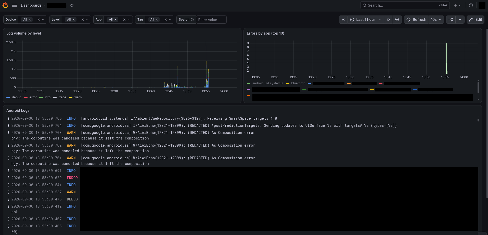

# LogStream

Stream an Android device's `logcat` output in real time over WebSockets to a Go server, which stores it in Loki for searching in Grafana.



## How it works

- **Android app** (`Android/`) — tails `logcat` in a foreground service and pushes each log line to a server as JSON over a WebSocket.
- **Server** (`Go/server/`) — a Go WebSocket hub that receives log events from device(s), broadcasts them to connected dashboards, and pushes them to Loki for persistent storage. Also serves `index.html`, a minimal raw view for checking that events are arriving.
- **Test client** (`Go/testclient/`) — a standalone Go program that simulates a device by sending one fake log event per second, useful for testing the server/dashboard without a real phone.
- **Loki** (`infrastructure/loki/`) — a local Loki instance (via Docker Compose) that the server pushes every `LogEvent` to, for historical/searchable log storage alongside the live dashboard.
- **Grafana** (`infrastructure/grafana/`) — a local Grafana instance (via Docker Compose) for querying and searching the logs stored in Loki.

```
Android device --(WebSocket: /v1/device/stream)--> Go server --(WebSocket: /v1/dashboard/stream)--> Browser dashboard
```

## Running the server

```
cd Go/server
go run .
```

The server listens on `:8080`:
- `POST/GET /v1/device/stream` — devices connect here and push log events
- `GET /v1/dashboard/stream` — browsers connect here to receive broadcasts
- `GET /` — serves the dashboard (`index.html`)
- `GET /healthz` — health check

Open `http://localhost:8080` in a browser for a raw live view of incoming events — a quick check that the pipeline works. For searching and filtering, use Grafana.

## Trying it without a phone

```
cd Go/testclient
go run .
```

This connects to `ws://localhost:8080/v1/device/stream` and streams synthetic log events once per second, which will appear on the dashboard.

## Running Loki

The server pushes every received `LogEvent` to Loki, at the URL from the `LOKI_URL` env var (defaults to `http://localhost:3100` if unset); a push failure is logged but doesn't block the live dashboard broadcast.

```
cd infrastructure/loki
docker compose up -d
```

This starts Loki on `:3100` using `loki-config.yaml` (filesystem storage under `infrastructure/loki/data`). It also creates the `logstream` Docker network that Grafana joins, so start Loki first.

## Running Grafana

```
cd infrastructure/grafana
docker compose up -d
```

This starts Grafana on `:3000` (data under `infrastructure/grafana/data`) on the external `logstream` network, so Loki must already be running. Everything it needs is provisioned from files on startup:

- `provisioning/datasources/loki.yaml` — the Loki data source (`http://logstream-loki:3100`)
- `provisioning/dashboards/logstream.yaml` + `dashboards/logstream.json` — the **LogStream** dashboard: filters for device, level, app and tag, a free-text search box, log volume by level, top errors by app, and the log list
- `provisioning/alerting/logstream.yaml` — an "Error spike per app" alert rule (>50 errors in 5 min). No contact point is configured, so it only shows up in Grafana's Alerting page.

Provisioned items are read-only in the Grafana UI; to change them, edit the files and restart Grafana (`docker compose restart`). To tweak the dashboard visually, edit it in Grafana, then use **Export → JSON** and save it over `dashboards/logstream.json`.

## Running the Android app

1. Copy the local properties template and fill in your values:
   ```
   cd Android
   cp local.properties.example local.properties
   ```
2. Edit `local.properties`:
   - `sdk.dir` — path to your Android SDK
   - `SERVER_URL` — the server's WebSocket device endpoint, e.g. `ws://192.168.1.100:8080/v1/device/stream` (use your machine's LAN IP, reachable from the device)
3. Build and install:
   ```
   ./gradlew installDebug
   ```
4. The app requires `READ_LOGS`; on a non-rooted device this permission must be granted manually. Then run:
   ```
   adb shell pm grant com.example.logstream android.permission.READ_LOGS
   ```
5. Restart the app:
   ```
   adb shell am force-stop com.example.logstream
   ```

Now open LogStream and press **Start Streaming**.

## Requirements

- Go 1.27+
- Android SDK 35, minSdk 26
- A device and server on the same network (the app uses `usesCleartextTraffic` for plain `ws://`)

## Planned architecture

The server fans each event both to connected dashboards and to Loki as a persistent, searchable log store, with Grafana on top of Loki for historical search:

```
                         ┌─────────────────────────────┐
                         │       Android Device        │
                         │                             │
                         │  LogStream App              │
                         │      │                      │
                         │      ▼                      │
                         │  Foreground Service         │
                         │  (specialUse)               │
                         │      │                      │
                         │      ▼                      │
                         │  Android Logcat             │
                         │  READ_LOGS granted via ADB  │
                         │      │                      │
                         │      ▼                      │
                         │  LogStreamClient             │
                         └──────┬──────────────────────┘
                                │
                                │ WebSocket
                                │ /v1/device/stream
                                ▼
                    ┌──────────────────────────┐
                    │        Go Server         │
                    │                          │
                    │  Device WebSocket        │
                    │          │               │
                    │          ▼               │
                    │     LogEvent             │
                    │          │               │
                    │     ┌────┴─────┐         │
                    │     │          │         │
                    │     ▼          ▼         │
                    │   Loki      Dashboard    │
                    │     │      WebSocket     │
                    │     │          │         │
                    └─────┼──────────┼─────────┘
                          │          │
                          ▼          ▼
                    ┌─────────┐   Browser
                    │  Loki   │   Dashboard
                    │  :3100  │
                    └────┬────┘
                         │
                         ▼
                   ┌───────────┐
                   │  Grafana  │
                   │   :3000   │
                   └───────────┘
```

- **Android** — the collector. `LogStreamService` (a foreground `specialUse` service) keeps `logcat -v long` running after the app is backgrounded, using system-wide `READ_LOGS` granted via `adb shell pm grant`. Each entry's UID is resolved to a package name by `AppResolver` (installed apps via `QUERY_ALL_PACKAGES`, plus platform and isolated UIDs). Parsed entries become structured `LogEvent` JSON (`device_id`, `seq`, `timestamp`, `priority`, `tag`, `pid`, `tid`, `uid`, `package`, `message`) and are sent over `/v1/device/stream` — raw logcat text never leaves the device.
- **Go server** — the ingestion/control layer. Each `LogEvent` received from a device does two things: it's pushed to Loki (`LokiClient.Push` in `Go/server/loki.go`, at the `LOKI_URL` env var, defaulting to `http://localhost:3100`) for historical search, and it's broadcast live to any connected dashboard over `/v1/dashboard/stream`. A Loki push failure is only logged, so the live dashboard doesn't depend on Loki/Grafana being up.
- **Loki** — the log storage/search backend, runs locally via Docker Compose (`infrastructure/loki/`, `:3100`). Each event is stored with the labels `job="logstream"`, `device_id`, `priority`, `level` (Android priority mapped to Grafana's level names: V→trace, D→debug, I→info, W→warn, E→error, F→critical), `tag`, and `app` (package name, or `unknown`), e.g. `{device_id="android-01", level="error", app="com.android.systemui"}`. The log line mirrors `adb logcat`: `[app] P/Tag(pid-tid): message`.
- **Grafana** — the operator/search UI (`infrastructure/grafana/`, `:3000`), the main UI: live tailing, search, filtering, time ranges, and dashboards across one or many devices, with the data source, dashboard and alert rule provisioned from files (see [Running Grafana](#running-grafana)).
- **Two views**: Grafana (`Go → Loki → Grafana`) is the main UI for tailing, searching and investigating; `index.html` (`Go → Browser`) is just a rough raw view to confirm events are flowing, independent of Loki/Grafana.
- **Multiple devices** — the architecture already supports this: additional Android devices connect to the same `/v1/device/stream` endpoint with distinct `device_id`s, and Loki labels make it possible to query a single device or across all of them.

See [TODO.md](TODO.md) for remaining work.
